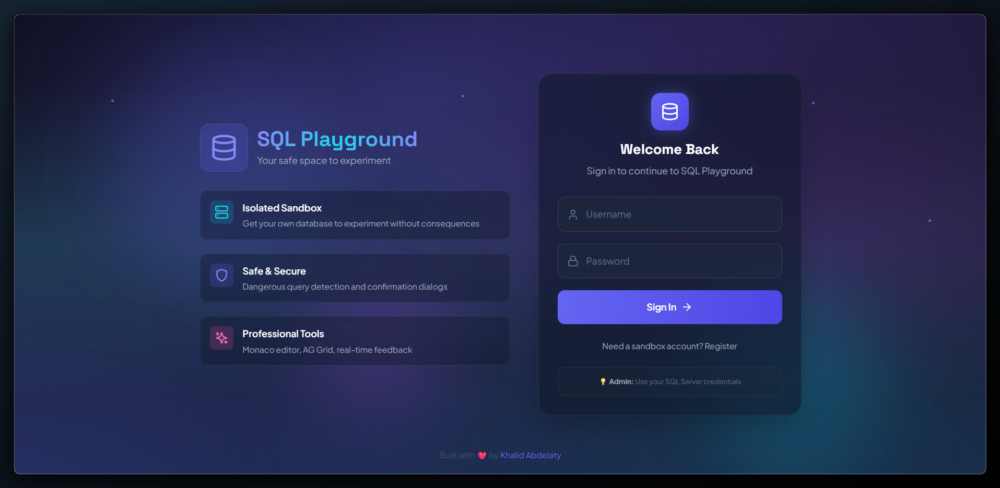
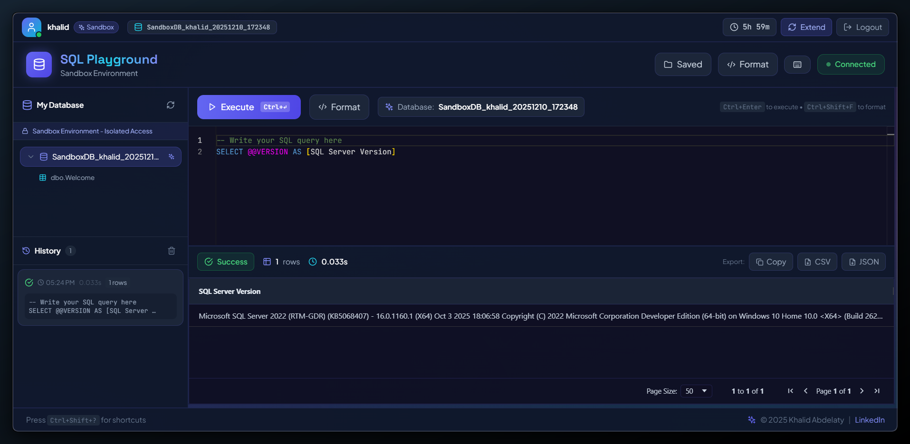

# 🚀 SQL Playground

**A modern, full-stack SQL development environment with isolated sandbox databases.**

Practice SQL without fear. Experiment freely. Learn by doing.

   

---

## ✨ Screenshots

### Login Page
Modern glassmorphism design with animated gradient background.



### SQL Playground Interface
Full-featured SQL development environment with schema browser, query history, and results grid.



---

## 💡 What Makes This Special?

### 🎯 **Sandbox Environments**
Every user gets their own isolated SQL Server database. Experiment, break things, and learn without consequences.

### 🔐 **Smart Security**
- Automatic detection of dangerous queries (DROP, TRUNCATE, etc.)
- Confirmation dialogs before destructive operations
- JWT-based authentication with session management
- Database size limits (100MB per sandbox)

### ⚡ **Real-Time Experience**
- Monaco Editor with SQL syntax highlighting and IntelliSense
- Live query execution with performance metrics
- Interactive schema browser with drag-and-drop
- Query history with one-click re-execution
- Export results to CSV or JSON

### 🎨 **Aurora Theme Design**
Beautiful dark mode UI with:
- Animated gradient mesh backgrounds
- Glassmorphism effects
- Smooth animations powered by Framer Motion
- Fully responsive for mobile devices

---

## 🆕 New Features

### Query Caching
- LRU cache with TTL for faster repeated queries
- Cache hit indicator in results

### Saved Queries
- Save your frequently used queries
- Organize with tags and favorites
- Quick access with `Ctrl+Shift+O`

### Query Formatter
- Beautify SQL with one click
- Configurable formatting options
- Keyboard shortcut: `Ctrl+Shift+F`

### Keyboard Shortcuts
| Shortcut | Action |
|----------|--------|
| `Ctrl + Enter` | Execute query |
| `Ctrl + Shift + F` | Format query |
| `Ctrl + Shift + Q` | Save current query |
| `Ctrl + Shift + O` | Open saved queries |
| `Ctrl + Shift + H` | Show all shortcuts |
| `Ctrl + K` | New query |
| `Esc` | Close dialogs |

### Toast Notifications
- Real-time feedback on all actions
- Success, error, and warning states
- Query execution results with timing

---

## 🛠️ Tech Stack

**Frontend:**
- **React 18** – Modern, component-based UI
- **Vite** – Lightning-fast development
- **Monaco Editor** – VS Code's editor
- **AG Grid** – Professional data tables
- **TailwindCSS** – Utility-first styling
- **Framer Motion** – Smooth animations

**Backend:**
- **FastAPI** – High-performance async Python
- **SQL Server** – Enterprise-grade database
- **SQLite** – Authentication storage
- **pyodbc** – Native SQL Server connectivity
- **JWT + bcrypt** – Secure authentication

---

## 🎬 Quick Start

### Prerequisites
- Python 3.8+
- Node.js 16+
- SQL Server 2019+
- ODBC Driver 17 for SQL Server

### Installation

**1. Clone the repository:**
```bash
git clone https://github.com/KhalidAbdelaty/SQL-PlAYGROUND.git
cd SQL-PlAYGROUND
```

**2. Backend Setup:**
```bash
cd backend
python -m venv venv
venv\Scripts\activate  # Windows
pip install -r requirements.txt
```

Create `backend/.env`:
```env
DB_SERVER=YOUR_SERVER_NAME
DB_DATABASE=master
DB_TRUSTED_CONNECTION=yes
DB_DRIVER=ODBC Driver 17 for SQL Server

JWT_SECRET=your-secret-key-here
ADMIN_SETUP_KEY=your-setup-key-here

HOST=0.0.0.0
PORT=8000
CORS_ORIGINS=http://localhost:5173
```

**3. Frontend Setup:**
```bash
cd ../frontend
npm install
```

Create `frontend/.env`:
```env
VITE_API_URL=http://localhost:8000
VITE_WS_URL=ws://localhost:8000
```

**4. Launch:**
```bash
# Terminal 1 - Backend
cd backend
python run.py

# Terminal 2 - Frontend
cd frontend
npm run dev
```

**5. Access:**
- Frontend: http://localhost:5173
- API Docs: http://localhost:8000/docs

---

## 🎮 Features

### For Administrators
- Full database access with SQL Server credentials
- Execute any query (with safety confirmations)
- Access all databases on the server

### For Sandbox Users
- Personal isolated database (auto-provisioned)
- Safe environment to learn and experiment
- All CRUD operations supported

### Query Editor
- Syntax highlighting with IntelliSense
- Execute with `Ctrl+Enter`
- Format with `Ctrl+Shift+F`
- Query history with re-execution
- Drag-and-drop table names

### Results Grid
- Sortable and filterable columns
- Pagination for large datasets
- Export to CSV or JSON
- Copy results to clipboard

---

## 🔒 Security

✅ SQL Injection Protection  
✅ Rate Limiting (60 req/min)  
✅ Dangerous Query Detection  
✅ Sandbox Isolation  
✅ Session Management (8hr expiry)  
✅ Password Hashing (bcrypt)  
✅ Database Size Limits  

---

## 🏗️ Architecture

```
┌─────────────────────────────────────────────────────────────┐
│                      Frontend (React)                        │
│  ┌────────────┐  ┌────────────┐  ┌────────────┐            │
│  │   Monaco   │  │  AG Grid   │  │   Toast    │            │
│  │   Editor   │  │  Results   │  │  Notifs    │            │
│  └────────────┘  └────────────┘  └────────────┘            │
└─────────────────────────────────────────────────────────────┘
                           │
                        HTTPS
                           │
┌─────────────────────────────────────────────────────────────┐
│                     Backend (FastAPI)                        │
│  ┌────────────┐  ┌────────────┐  ┌────────────┐            │
│  │    Auth    │  │   Query    │  │   Cache    │            │
│  │  Service   │  │  Executor  │  │  Service   │            │
│  └────────────┘  └────────────┘  └────────────┘            │
└─────────────────────────────────────────────────────────────┘
                           │
                   ┌───────┴───────┐
                   │               │
           ┌───────▼──────┐ ┌─────▼──────┐
           │  SQL Server  │ │  SQLite    │
           │  (Queries)   │ │  (Auth)    │
           └──────────────┘ └────────────┘
```

---

## 📊 API Endpoints

### Authentication
- `POST /api/auth/login` – Login
- `POST /api/auth/register-sandbox` – Create sandbox account
- `POST /api/auth/logout` – Logout and cleanup
- `POST /api/auth/extend-session` – Extend session

### Query Execution
- `POST /api/execute` – Execute SQL query
- `GET /api/history` – Get query history
- `POST /api/query/format` – Format SQL

### Saved Queries
- `GET /api/query/saved` – List saved queries
- `POST /api/query/saved` – Save a query
- `DELETE /api/query/saved/{id}` – Delete saved query

### Schema
- `GET /api/databases` – List databases
- `GET /api/schema/{database}` – Get schema

**Full API Documentation:** http://localhost:8000/docs

---

## 🎯 Use Cases

### 👨‍🎓 Learning SQL
Practice without setting up your own database server.

### 🧪 Testing Queries
Test complex queries safely before production.

### 👨‍🏫 Teaching
Give students isolated environments for exercises.

### 🔬 Experimentation
Try new SQL features and prototype designs.

---

## 🚧 Roadmap

- [x] Query caching system
- [x] Saved query templates
- [x] Keyboard shortcuts
- [x] Toast notifications
- [x] Mobile responsive design
- [ ] Query execution plans visualization
- [ ] Collaborative query sharing
- [ ] Database diagram generator
- [ ] Multi-database support (PostgreSQL, MySQL)

---

## 🤝 Contributing

Contributions welcome!

1. Fork the repository
2. Create your feature branch (`git checkout -b feature/AmazingFeature`)
3. Commit your changes (`git commit -m 'Add AmazingFeature'`)
4. Push to the branch (`git push origin feature/AmazingFeature`)
5. Open a Pull Request

---

## 📝 License

MIT License – feel free to use, modify, and build upon it.

---

## 👨‍💻 About Me

**Khalid Abdelaty** – Data Engineer passionate about building tools that make data work easier.

- 💼 [LinkedIn](https://www.linkedin.com/in/khalidabdelaty/)
- 🐙 [GitHub](https://github.com/KhalidAbdelaty)

---

<div align="center">
  <sub>Built with ❤️ by Khalid Abdelaty</sub>
  <br>
  <sub>© 2025</sub>
</div>
